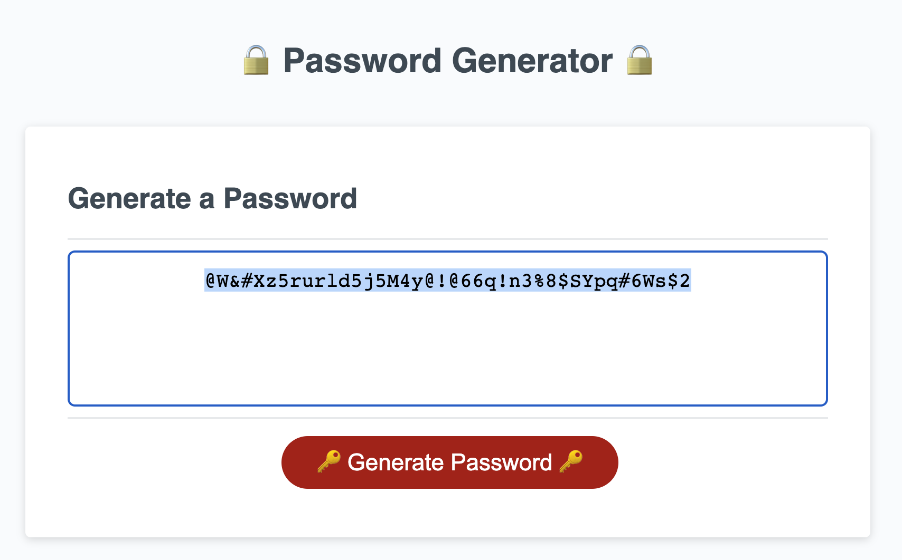

# Andrew(Sheng-Chu), Chou's Portfolio

## 🐼 Overview:
> * Generate an unique password based on users' requirements
>
> * Automatically redirect for the users
>
> * Pure JavaScript Application

> **Note**: This is the first version of the password generator. Plan to add more features such as displaying more information on the browser, showing more user-friendly UI, and copy & paste function in the future.
>


## 🐨 Website URL:
❗❗❗ ☛ [Clik Me To The Page!](https://andrew-techmaster.github.io/Andrew-UWBootcamp-Challenge-03-Password-Generator/) ☚ ❗❗❗
```
https://andrew-techmaster.github.io/Andrew-UWBootcamp-Challenge-03-Password-Generator/
```


## 🐻 Screenshots Of The Applications:

||
|:--:| 
| *Click button to generate the password* |

||
|:--:| 
| *Demo for length of 40 including every types* |

### The following shows some of the error messages:
||
|:--:| 
| *When user's input is a string* |

||
|:--:| 
| *When the length of the password is over 128* |

||
|:--:| 
|*When users select nothing, will redirect to the options again*|
- - -
© 2022 edX Boot Camps LLC. Confidential and Proprietary. All Rights Reserved.
